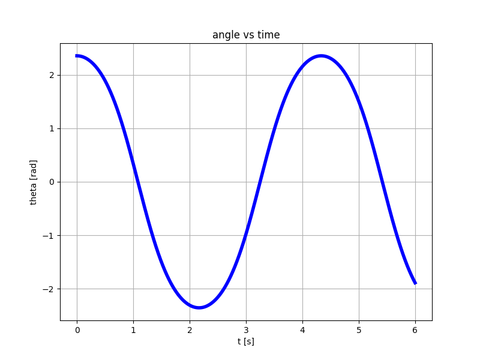
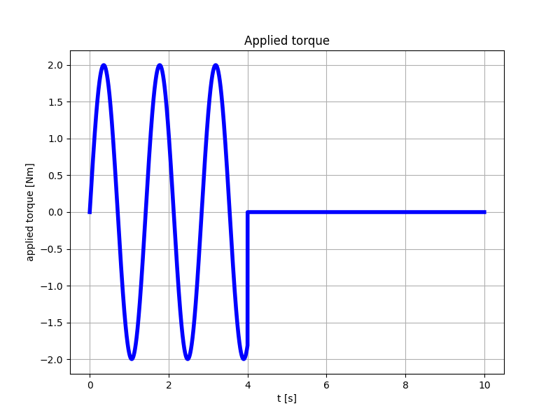
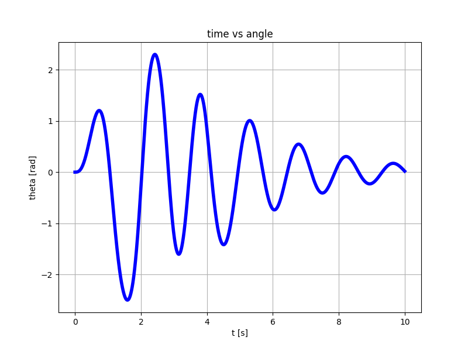
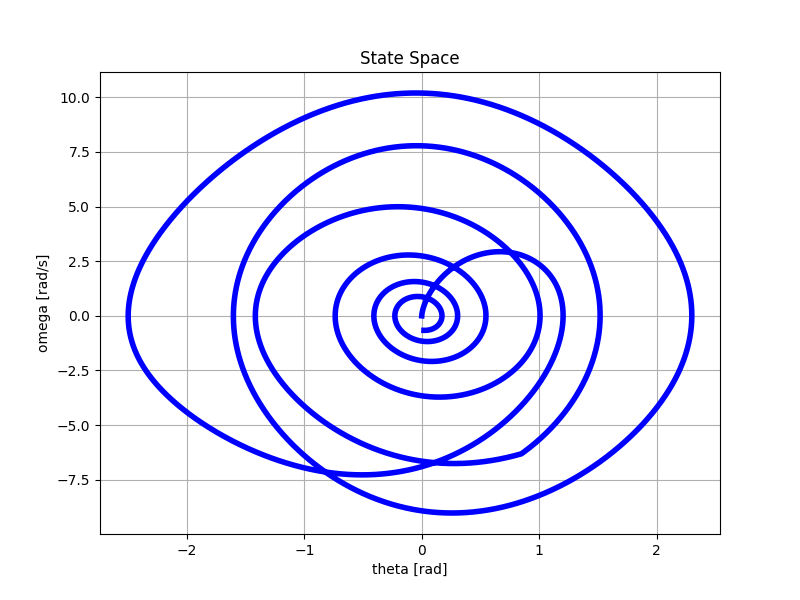
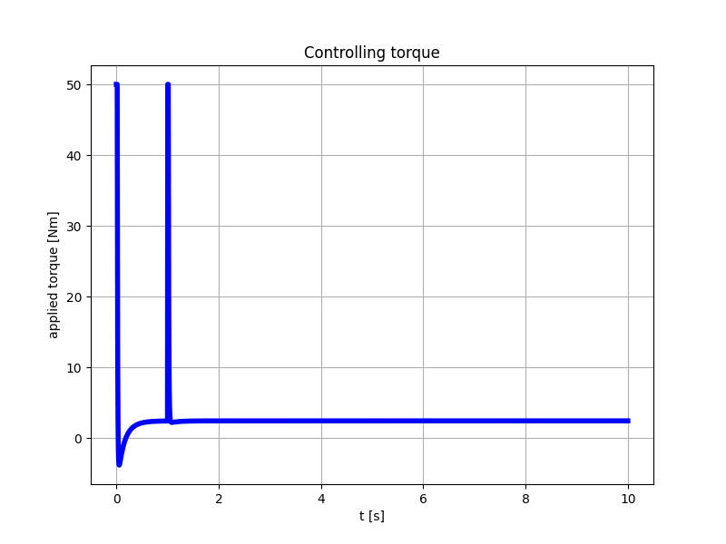

# Non-Linear Pendulum
Simulate a non-linear pendulum in time domain without using the small-angle approximation.

Let:
- `theta` be the angular position
- `omega` be the angular velocity
- `alpha` be the angular acceleration

An immediate discretization method would look as follows:
- `theta(t + dt) = omega(t) * dt`
- `omaga(t + dt) = alpha(t) * dt`

However, I was initially unable to calculate omega, and hence I found an alternative solution.

## Method 1 - Taylor expansion
The discretized equation for the `theta` can be derived as follows:
- Compute two Taylor expansions for `theta(t +/- dt)` truncated at the 2nd order wherein
- I add the two expansions and solve for `theta(t + dt)`

```
theta(t + dt) - theta(t) =~ +omega(t) * dt + 1/2 alpha(t) * dt^2  +
theta(t - dt) - theta(t) =~ -omega(t) * dt + 1/2 alpha(t) * dt^2  =
--------------------------------------------------------------------
theta(t + dt) + theta(t - dt) =~ alpha(t) * dt^2 =>
┍━━━━━━━━━━━━━━━━━━━━━━━━━━━━━━━━━━━━━━━━━━━━━━━━━━┑
| theta(t + dt) =~ alpha(t) * dt^2 - theta(t - dt) |
┕━━━━━━━━━━━━━━━━━━━━━━━━━━━━━━━━━━━━━━━━━━━━━━━━━━┙
```

> NOTE 1: The result does not involve `omega`

> NOTE 2: Expanding to the 3rd would cause the extra term to disappear with the sum -> this approximation is very good!

I don't trust this approach because I made it up. However, I verified that:
- The angular frequency for small angles
- The energy is conserved when no perturbation is applied

### Example 1 - impulse response - no perturbations
This demo shows the validity of this method when no perturbation is applied and the energy is conserved.
```
python3 example_01.py
```
With the default values, the output is



### Example 2 - damping force + input force 
In this demo, external forces are applied and the result looks ok.
```
python3 example_02py
```





> WARNING! Don't stare at the pendulum for too long! :)

### Example 3 - PID-controlled system
A simple PID controller sets the pendulum to a desired position.
An impulsive perturbation is applied after steady state is almost reached. Then the system goes back to steady state. The maximum torque is limited to avoid unphysical responses. 



## Method 2 - Calculate `omega`
I eventually figured out that `omega` can be immediately derived from the conservation of energy.
```
m * v^2
------- - m * g * l * (1 - cos(theta)) = E  =>
   2
┍━━━━━━━━━━━━━━━━━━━━━━━━━━━━━━━━━━━━━━━━━━━━━━━━━━━━━━━━┑
| omega^2 = (2 * E / l^2 - 2 * g / l * (1 - cos(theta))) |
┕━━━━━━━━━━━━━━━━━━━━━━━━━━━━━━━━━━━━━━━━━━━━━━━━━━━━━━━━┙

```

It's easy to verify that

```
d                                  2 * g
-- omega^2 = 2 * omega * alpha = - ----- sin(theta) * omega =>
dt                                   l

           g
alpha = - --- sin(theta)
           l
```
as expected. This shows that the formula for `omega^2` is correct, but what's `omega`?.

<blockquote>
Problems:

- Some logic is needed to detect a direction change for `omega`.
- The total energy deviation does not improve compared to the previous method.
</blockquote>

For now, the velocity sign is inverted when the kinetic energy is almost 0 and is less than the kinetic energy at the previous step.
**If you have a better idea, please share it.**

For testing, run
```
python3 explicit-omega.py
```

# Resources:
- [Equations](https://en.wikipedia.org/wiki/Pendulum_(mechanics))
