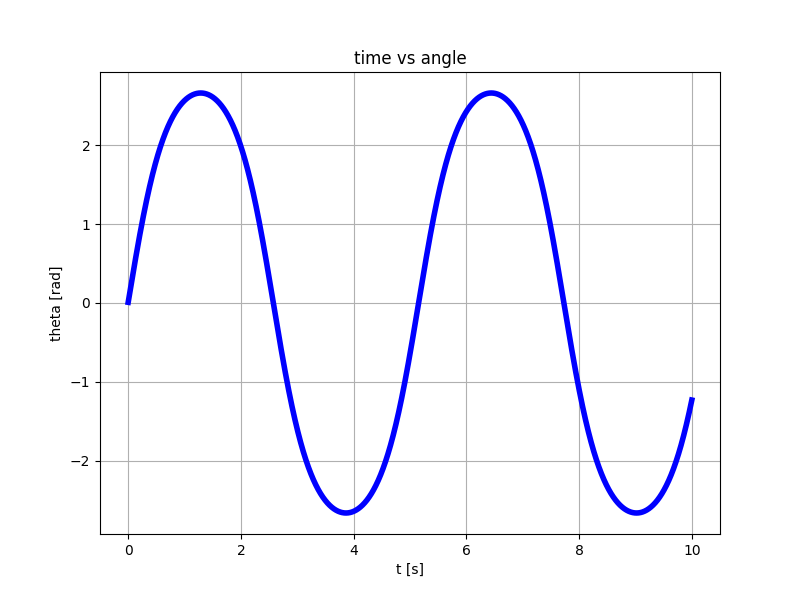

# Non-Linear Pendulum
Simulate a non-linear pendulum in time domain without using the small-angle approximation.
I cannot find a concrete implementation online so I made this up and I am not sure this is correct.
However, some things match:
- The angular frequency for small angles
- The energy is conserved when no perturbation is applied

The update equation follows this idea:
- I know the formula to calculate `theta_double_dot` (aka `alpha`)
- I don't know a closed formula for the angular speed (`theta_dot` or `omega`)
- I create two truncated Taylor expansions for `delta theta` wherein the speed has opposite sign
- I add the two expansions up and I don't need to know `omega` to update theta

```
theta(t + dt) - theta(t) =~ +theta_dot(t) * dt + 1/2 theta_double_dot(t) * dt^2  +
theta(t - dt) - theta(t) =~ -theta_dot(t) * dt + 1/2 theta_double_dot(t) * dt^2  =
--------------------------------------------------------------------------------
theta(t + dt) + theta(t - dt) =~ alpha(t) * dt^2 =>
theta(t + dt) =~ alpha(t) * dt^2 - theta(t - dt)
```

## Example 1 - impulse response - no perturbations
```
python3 non-linear-pendulum.py
```
With the default values, the output is



## Example 2 - damping force + external force 
```
python3 non-linear-pendulum-with-perturbations.py
```


> WARNING! Don't stare at the pendulum for too long! :)

# Resources:
- [Equations](https://en.wikipedia.org/wiki/Pendulum_(mechanics))
