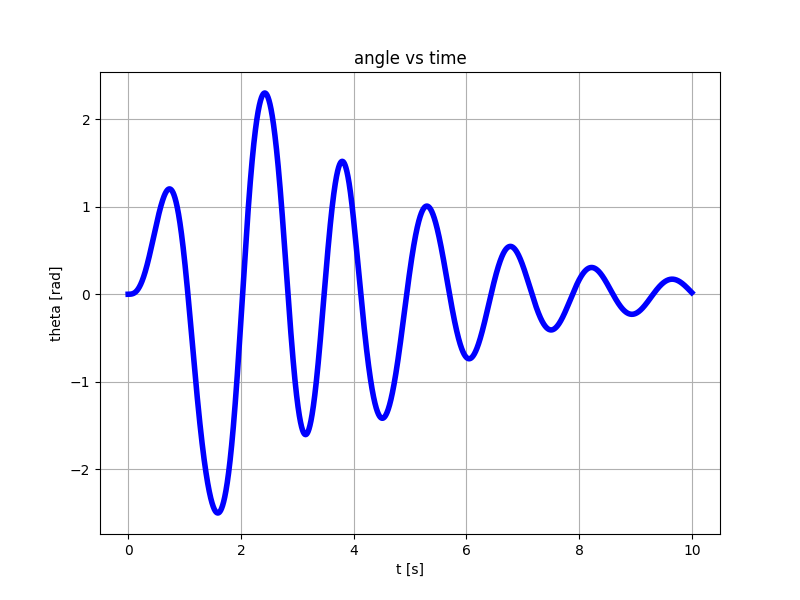

# Non-Linear Pendulum
Simulate a non-linear pendulum in time domain without using the small-angle approximation.
Let
- $`\theta`$ be the angular position
- $`\omega`$ be the angular velocity
- $`\alpha`$ be the angular acceleration

The angular acceleration due to gravity is given by
```math
\alpha(t) = - \dfrac{g}{l}\sin(\theta(t))
```

An immediate discretization method would look as follows:
- $`\theta(t + dt) = \omega(t) * dt`$
- $`\omega(t + dt) = \alpha(t) * dt`$


## Method 1 - Taylor expansion - central difference
I am unable to calculate $`\omega`$, and hence I found an alternative solution.

The discretized equation for the $`theta(t)`$ can be derived as follows:
- Compute two Taylor expansions for `theta(t +/- dt)` truncated at the 2nd order wherein
- I add the two expansions and solve for `theta(t + dt)`

```
theta(t + dt) - theta(t) =~ +omega(t) * dt + 1/2 alpha(t) * dt^2  +
theta(t - dt) - theta(t) =~ -omega(t) * dt + 1/2 alpha(t) * dt^2  =
--------------------------------------------------------------------
theta(t + dt) + theta(t - dt) =~ alpha(t) * dt^2 =>
┍━━━━━━━━━━━━━━━━━━━━━━━━━━━━━━━━━━━━━━━━━━━━━━━━━━┑
| theta(t + dt) =~ alpha(t) * dt^2 - theta(t - dt) |
┕━━━━━━━━━━━━━━━━━━━━━━━━━━━━━━━━━━━━━━━━━━━━━━━━━━┙
```

> NOTE 1: The result does not involve $`\omega`$

> NOTE 2: Expanding to the 3rd would cause the extra term to disappear with the sum -> this approximation is very good!

I don't trust this approach because I made it up. However, I verified that:
- The angular frequency for small angles
- The energy is conserved when no perturbation is applied

### Example 1 - impulse response - no perturbations
This demo shows the validity of this method when no perturbation is applied and the energy is conserved.
```
python3 example_01.py
```
With the default values, the output is


### Example 2 - damping force + input force 
In this demo, external forces are applied and the result looks ok.
```
python3 example_02py
```





> WARNING! Don't stare at the pendulum for too long! :)

### Example 3 - PID-controlled system
A simple PID controller sets the pendulum to a desired position.
An impulsive perturbation is applied after steady state is almost reached. Then the system goes back to steady state. The maximum torque is limited to avoid unphysical responses. 


### Example 4 - Current, not torque
So far, I have assumed that we can control the applied torque directly.
This is assumption is now removed by creating a actuator (a non-ideal current generator),
taking into account the delay between setting a desired current and actually producing it,
and ensuring that the current saturates according to a sigmoid function.
```
          ┍━━━━━━━━━┑            ┍━━━━━━━━━━━━━━━━┑
  i_d(t)  |    a    | i_prime(t) |                |  i(t) + n(t)
  ━━━━━━> | ------- | ━━━━━━━━━━>| M * tanh(in/M) | ━━━━━━━━━━━━>
          |  s + a  |            |                |
          ┕━━━━━━━━━┙            ┕━━━━━━━━━━━━━━━━┙
```
where
- `i_d(t)` desired current calculated by the PID controller
- `i_prime(t)` the current generated by the actuator
- `i(t)` is non-linear, saturated current `i(t)`
- `n(t)` is the Gaussian noise produced by the current generator
- `M` is the saturation current 
- `a` is the cutoff frequency of the current generator

The produced torque is assumed to be proportional to the applied current.

Some extra noise has been added to the measured angle $`\theta`$.

## Method 2 - Calculate $`\omega(t)`$
I eventually figured out that $`\omega(t)`$ can be immediately derived from the conservation of energy.
```
m * v^2
------- - m * g * l * (1 - cos(theta)) = E  =>
   2
┍━━━━━━━━━━━━━━━━━━━━━━━━━━━━━━━━━━━━━━━━━━━━━━━━━━━━━━━━━━━━┑
| omega^2 = (2 * E / l^2 / m - 2 * g / l * (1 - cos(theta))) |
┕━━━━━━━━━━━━━━━━━━━━━━━━━━━━━━━━━━━━━━━━━━━━━━━━━━━━━━━━━━━━┙

```

It's easy to verify that

```
d                                  2 * g
-- omega^2 = 2 * omega * alpha = - ----- sin(theta) * omega =>
dt                                   l

           g
alpha = - --- sin(theta)
           l
```
as expected. This shows that the formula for $`\omega(t)^2`$ is correct, but what is the sign $`\omega(t)`$?.

<blockquote>
Problems:

- Some logic is needed to detect a direction change for `omega`.
- The total energy deviation does not improve compared to the previous method.
</blockquote>

For now, the velocity sign is inverted when the kinetic energy is almost 0 and is less than the kinetic energy at the previous step.

> **If you have a better idea, please share it.**

For testing, run
```
python3 explicit-omega.py
```

## Method 3 - Exploit $`\omega^2`$
I thought: what happens if you calculate the Taylor series for $`\theta(t + dt)`$ up to the 4th order?
As for the 1st-order term, also the 3rd order will cancel out when taking the sum $`\theta(t + dt) + \theta(t - dt)`$.
The extra term multiplied by $`dt^4`$ will give little contribution due to the usual choice of a small $`dt`$.
However, this also means we can take a larger $`dt`$ and improve the speed of the simulation, maybe...

#### The math
Let $`f(\theta(t)) = \alpha(t)`$.
```math
\dot{\alpha(t)} = f'(\theta(t))\omega(t)
```

```math
\ddot{\alpha(t)} = f''(\theta(t))\omega(t)^2 + f'(\theta(t))\alpha(t)
```
The last equation shows that the 4th term in the Taylor series depends on $`\omega^2`$, which was already calculated in [Method 2](https://github.com/antonioastorino/nlp?tab=readme-ov-file#method-2---calculate-omega)

Considering that $`f''(\theta(t)) = g/\ell\sin(\theta(t)) = -\alpha(t)`$, we can write:
```math
\ddot{\alpha(t)} = \alpha(t)(f'(\theta(t)) - \omega(t)^2)
```

Using the Taylor series truncated at the 4th order and the central difference method, we obtain

```math
\theta(t+dt) \approx 2\theta(t) -\theta(t - dt) +\alpha(t) dt^2 + \dfrac{dt^4}{12}\ddot{\alpha(t)}
```
or

```math
\theta(t+dt) \approx 2\theta(t) -\theta(t - dt) + \alpha(t) \left(dt^2 + \dfrac{dt^4 }{12}(f'(\theta(t)) - \omega(t)^2)\right)
```

We can now use $`f'(\theta(t)) = -g/\ell\cos{\theta(t)}`$ and $`\omega^2 = 2E/(\ell^2m) + 2g/\ell (1 - \cos(\theta(t)))`$ (derived from the conservation of the energy) to write

```math
\theta(t+dt) \approx 2\theta(t) -\theta(t - dt)  -\dfrac{g}{l}\sin(\theta(t)) \left\{dt^2 + \dfrac{dt^4}{12}\left[-\dfrac{g}{l}\cos(\theta(t)) - \dfrac{2E}{\ell^2m} - \dfrac{2g}{\ell}(1 - \cos(\theta(t)))\right]\right\}
```

```math
\theta(t+dt) \approx 2\theta(t) -\theta(t - dt)  -\dfrac{g}{l}\sin(\theta(t)) \left[dt^2 + \dfrac{dt^4 }{12\ell}\left(g\cos(\theta(t)) - \dfrac{2E}{\ell m} - 2g\right)\right]
```

# Resources:
- [Pendulum - Wikipedia](https://en.wikipedia.org/wiki/Pendulum_(mechanics))
